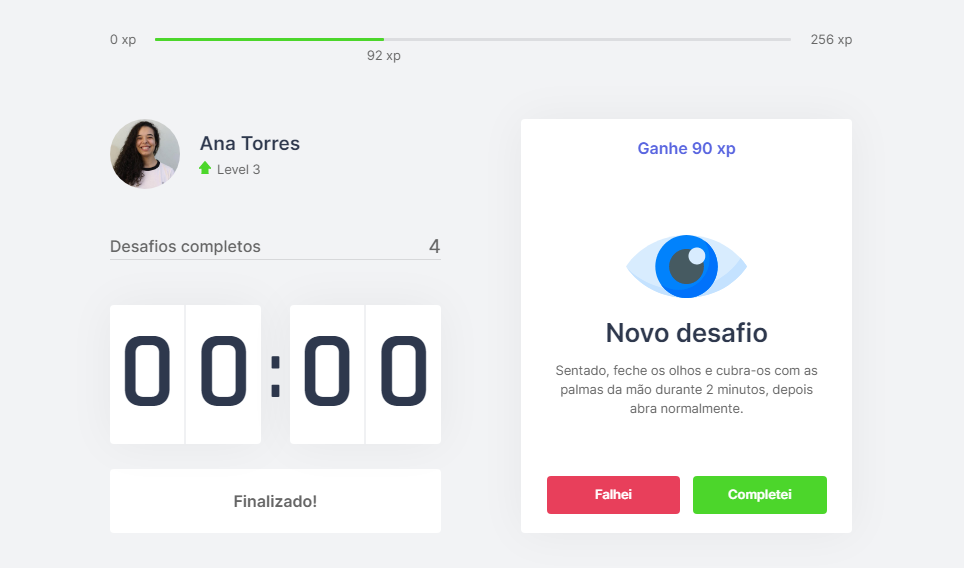

<h1 align="center">
    Time Up | NLW#4
</h1>

 Application developed in the fourth edition of Rocketseat Next Level Week 💻🚀 

 <a href="#objective">Objective</a> •
 <a href="#technologies">Technologies</a> • 
 <a href="#contribution">Contribution</a> • 
 <a href="#author">Author</a> • 
 <a href="#license">License</a>

<h1 align="center">
  
</h1>

<h4 align="center"> 
	🚧 Time Up | NLW#4 ⏰📈 Loading...  🚧
</h4>

<h2 id="objective" > 🎯 Objective </h2>

Track your time, be more productive and take care of your health. The layout of Move.it is available <a href="https://www.figma.com/file/ge20pu3ofMOKoliUyKx1Nl/?viewer=1&node-id=">here</a>.

<h2 id="technologies"> 🛠 Technologies </h2>

The following tools were used in the construction of the project:

- [React](https://reactjs.org)
- [Next](https://nextjs.org)
- [Node.js](https://nodejs.org/en/)
- [VSCode](https://code.visualstudio.com)
- [Git Bash](https://gitforwindows.org/)

<h2 id="contribution"> 🤝 Contribution </h2>

This project is for study purposes too, so send me an email telling me what you are doing and why you are doing it, teach me what you know. All kinds of contributions are very welcome and appreciated!

<h2 id="author"> 💻 Author </h2>

By Ana Torres 👋🏽 Find me:

<h2 id="license"> 📝 License </h2>

This project is under the MIT license.
